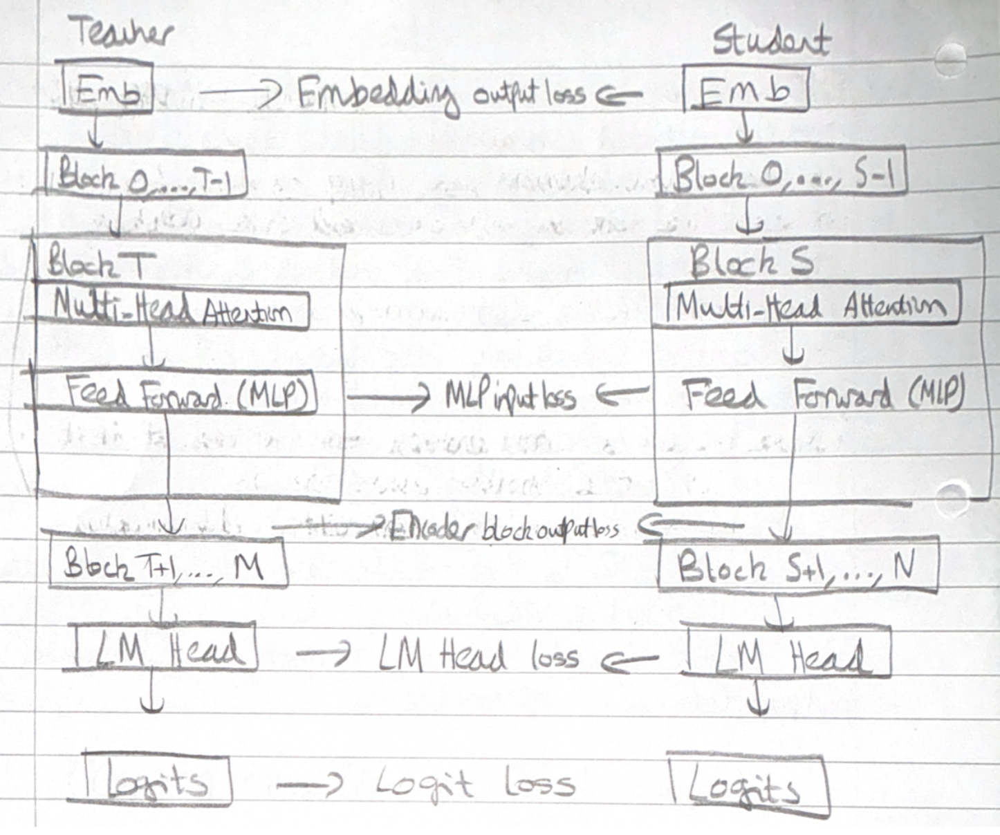

This post is a brief introduction to the major types of knowledge distillation used when training Language Models. It should provide a conceptual overview of how this is done - code examples may follow in subsequent posts. 

Knowledge Distillation (KD) is the process of transferring capabilities from a large, computationally expensive "Teacher" model to a smaller, efficient "Student" model. By mimicking the teacher, the student learns not just the final answers, but the reasoning and uncertainty embedded in the teacher's internal states.

The most fundamental form of distillation involves matching the output probability distributions of the two models.

## Softmax Temperature

Standard models output a probability distribution over the vocabulary. In KD, we introduce a Temperature ($\tau$) parameter to "soften" this distribution, revealing hidden relationships between classes.
The probability of an input token $x_i$ is given by:

$$Pr(x_{i},\tau)=\frac{exp[x_{i}/\tau]}{\sum_{j=1}^{|V|}exp[x_{j}/\tau]}$$

where

$\tau$: The softmax temperature. A higher $\tau$ produces a smoother distribution.

$|V|$: The vocabulary size.

## Logit Distillation loss

To train the student, we compare its soft logits against the teacher's soft logits. 
The loss is computed across the sequence of all tokens:

$$L_{logits}=\frac{1}{l}\sum_{k=1}^{l}loss(p_{t}^{k}(x,\tau),p_{s}^{k}(x,\tau))$$

where

* $l$: The sequence length.

* $p_{t}^{k}$ and $p_{s}^{k}$: The teacher and student probability distributions at the $k$-th token, given the previous context.

The loss function aims to minimise divergence between teacher and student probability distributions. The most popular kinds of divergence tend to be:

1. Forward KL divergence: $$\sum p(t) log[\frac{p(t)}{q(t)}]$$

2. Reverse KL divergence: $$\sum q(t) log[\frac{q(t)}{p(t)}]$$

3. JS divergence: $$\frac{1}{2}[\sum p(t) log[\frac{2p(t)}{p(t)+q(t)}] + \sum q(t) log[\frac{2q(t)}{p(t)+q(t)}]]$$

Empirically, reverse KL divergence is preferable for tasks like dialogue generation and instruction tuning. Note, in the identities above one distribution will be the teacher model's distribution and the other will be the student model.

### Remarks
Given a teacher distribution $p(y | x)$ and student distribution $q_{\theta}(y | x)$ parameterised by $\theta$, standard KD objectives minimise the forward KL divergence between teacher and student distributions. 
The KL divergence forces $q_{\theta}$ to cover all modes of $p$.

For open ended text generation tasks, which is usually the case with LLMs, the output space - over all tokens in a vocabulary, are more complex.
$p(y | x)$ can contain many more modes than what $q_{\theta}(y | x)$ can express due to the limited model capacity.

Minimising forward KL divergence causes $q_{\theta}$ to assign unreasonably high probabilities to void regions of $p$ and produces unlikely samples under $p$ under free-run generation.
If reverse KL divergence is minimised, it causes $q_{\theta}$ to seek major modes of $p$, and assign low probability to the void regions in $p$.

## White-Box Distillation: Matching Internal states

Beyond just the final output, deeper distillation aligns the internal "brains" of the models—their intermediate hidden states.

The student model learns by minimising a combination of embedding output loss, logit loss and transformer encoder-decoder specific losses.

The intermediate-state based KD loss is computed across a sequence of Transformer specific hidden states

$$L_{is} = \frac{1}{l} \sum_{k \in H} \sum_{i=1}^{l} loss_{k}(h_{t}^{k_{i}}, h_{s}^{k_{i}})$$

where

* $(h_{t}^{k_{i}}, h_{s}^{k_{i}})$ represents the kth hidden state for the i-th token. 

* $l$ is the sequence length.

* $H$ is a set of intermediate states.

A common challenge is that the student model and teacher models will have mismatched hidden states - the matrix/ vector dimensions may be incompatible. 
To address this, a shared linear transformation is learned during distillation which upscales and maps the student hidden state to the same dimensional space as the teacher hidden state. 
The hidden states used are always after the LayerNorm operation.

The total loss is computed as:
$$\mathcal{L} = L_{CLM} + L_{logits} + \alpha L_{is}$$

where

* $L_{CLM}$ is the cross entropy loss for the student model on the ground truth labels/ data.

* $\alpha$ is a dynamically computed weight.

## Blackbox Distillation

When we cannot access the teacher's weights (Black-Box Distillation), we use a "Distillation Pipeline" to generate synthetic training data.

Step 1: **Domain Steering** - We direct the Teacher LLM toward a specific target domain using prompts and instructions. The goal is to elicit outputs rich in the specific skills we want the student to learn.

Step 2: **Seed Knowledge** - We feed the teacher a small "seed" dataset relevant to the domain.

Step 3: **Generation** - The teacher generates new examples, often in the form of Question-Answer dialogues or narrative explanations. This creates a synthetic dataset $D_{I}^{(kd)}$.

Step 4: **Student Training** - The student is trained on this generated data using Supervised Fine Tuning (SFT). The objective is to maximize the likelihood of generating the teacher's sequences:

$$L_{SFT}=E_{x\sim X,y\sim p_{T}(y|x)}[-log(p_{s}(y|x))]$$

Here, the target sequence $y$ is produced by the teacher $p_T$ given prompt $x$.

More formally, the process of eliciting knowledge is given as 

$$D_{I}^{(kd)} = \{ parse(o, s): o \sim P_{T}(o| I \bigoplus s), \forall s \sim S \}$$

where
* $\bigoplus$ denotes text concatenation

* $I$ denotes an instruction to steer the LLM to elicit desired knowledge

* $s \sim S$ denotes seed knowledge sampled from a seed dataset, upon which the LLM can explore to generate novel knowledge

* $parse(o, s)$ is a parsed output of an output from the teacher LLM

* $p_{T}$ is a teacher LLM with model parameters $$\theta_{T}$$

Given the distillation dataset $D_{I}^{(kd)}$, define a learning objective

$$\mathcal{L} = \sum_{I} L_{I}(D_{I}^{(kd)}; \theta_{s})$$

where

* $\sum_{I}$ denotes that there could be multiple tasks that could be distilled into the student model

* $\theta_{s}$ parameterises the student model

## Appendix A: Supervised Fine Tuning (SFT)

SFT fine tunes the student model by maximising the likelihood of sequences generated by teacher LLMs, aligning the student’s predictions with those of the teacher.
The objective function is to minimise

$$\mathcal{L}_{SFT} = E_{x \sim \mathcal{X}, y \sim p_{T}(y|x)}[-log( p_{s}(y|x))]$$

where 

* $y$ is the output sequence produced by the teacher model

* The teacher model $p_{T}$ takes a prompt $x$ and produces an output $y$. We want the student model $p_{s}$, to generate an output sequence $y$ such that the negative log probability is minimised.

* The target sequence for the student model, $p_{s}$, is the output of the teacher model with the prompt $x$ - $p_{T}(y|x)$

## Appendix B: Distance and Similarity Functions

If using Similarity, the aim is to align the hidden states or features of the student model with the teacher model.
The objective is to ensure the student model processes information in a comparable manner. One formulation of a similarity based objective may be

$$L_{sim} = \mathbb{E}_{}[L_{F}(\Phi_{T}(f_{T}(x,y)),\ \Phi_{S}(f_{S}(x, y))]$$

where

* $f_{T}(x,y)$, $f_{S}(x,y)$ are feature maps of the teacher and student models

* $\Phi_{T}$, $\Phi_{S}$ are transformation functions applied to the feature maps to ensure they are the same shape

* $L_{F}$ is a similarity function which matches transformed feature maps

Common choices for $L_{F}$ are:

1. L2 Norm Distance: $||\Phi_{T}(f_{T}(x, y)) -  \Phi_{S}(f_{S}(x, y))||_{2}$
2. L1 Norm Distance: $||\Phi_{T}(f_{T}(x, y)) -  \Phi_{S}(f_{S}(x, y))||_{1}$
3. Cross Entropy loss: $-\sum \Phi_{T}(f_{T}(x, y))\ log(\Phi_{S}(f_{S}(x, y)))$
4. Maximum Mean Discrepancy: $MMD[\Phi_{T}(f_{T}(x, y), \Phi_{S}(f_{S}(x, y))]$

## Appendix C: Model Pruning

Weight pruning is a technique for reducing model size. First, the importance of each model layer, neuron, head and embedding dimension is computed. Then these importance scores are sorted to compute an importance ranking.

Multi-layer perceptron (MLP) layers have 2 linear layers with a nonlinear activation in between:

$$MLP(X) = \delta(XW^{T}_{1})W_{2}$$

where 

* $X$ is the input matrix

* $W_1, W_2 \in \mathbb{R}^{d_{hidden} \times d_{model}}$ are associated weight matrices

* $\delta$ is a nonlinear activation

The Multi-head attention (MHA) operation for an input $X$ as 

$$MHA(X) = Concat(h_{1},...,h_{L})W^{0}$$

$$h_{i} = Attn(XW^{Q, i}, XW^{K, i}, XW^{V, i})$$

where

* $XW^{Q, i}, XW^{K, i}, XW^{V, i} \in \mathbb{R}^{d_{head} \times d_{model}}$

* $W^{0} \in \mathbb{R}^{(L \times d_{head}) \times d_{model}}$ → $L$ are the total number of attention heads and $d_{head}$ is the size of a single attention head.

Layer Normalisation is defined as:

$$LN(X) = (\frac{X - \mu}{\sqrt{\sigma^{2} + \epsilon}} \odot \alpha) + \beta$$